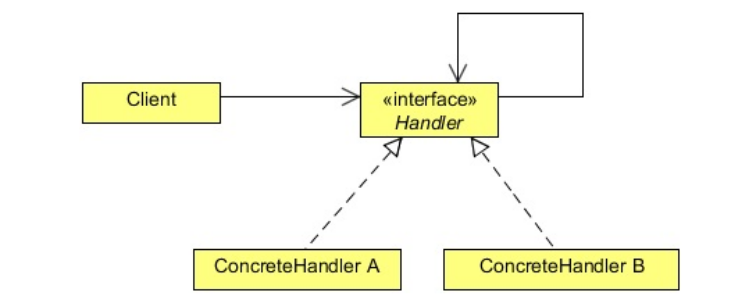

## Chain of Responsibility Pattern (Behavioral)

## Project Requirements
- Our company has got a contract to provide an analytical application to a health company. The application would tell the user about the particular health problem.
- It's history, treatment, medicines, interview of the person suffering from it etc. everything that is needed to know about it.
- For this our company receives a huge amount of data. The data could be in any format, it could be text files, doc files, excels, audio, images, videos anything that we can think of would be there.
- Now our job is to save the data in the company's database. Users will provide the data in any format an you should provide them a single interface to upload the data into the database.
- The user is not interested, not even aware, to know that how you are saving the different unstructured data.

## Development challenges
- The problem here is that you need to develop different handlers to save the various formats of data. For example, a text file save handler does not know how to save an mp3 file.

## How Chain of Responsibility method resolves the challenges
- You can create different objects which process different formats of data and chain them together.
- When a request comes to a single object, it will check whether it can process and handle the speicific file format.
- If it can, it will process it, otherwise, it will forward it to the next object chained to it.

## What is Chain of Responsibility pattern?
- This pattern is all about connecting objects in a chain of notification; as a notification travels down the chain, it's handled by the first object that is set up to deal with particular notification.

## Real life scenario
- In order to understand this pattern, suppor

## Elements of Chain of Responsibility pattern

- **Handler:**
  - Defines an interface for handling requests.
  - (Optionally) implements the successor link.
- **ConcreteHandler:**
  - Handles requests it is responsible for.
  - Can access its successor.
  - If the **ConcreteHandler** can handle the request, it does so, otherwise it forwards to it's successor.
- **Client:**
  - Initiates the request to a **ConcreteHandler** object on the chain.

## How it helps?
