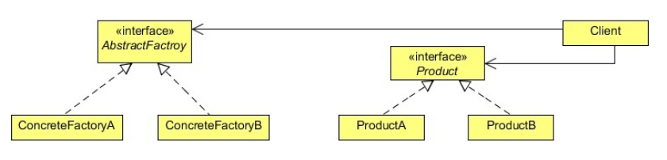

## Abstract Factory Method Design Pattern

## Project Requirements
- The client want to use their own XML rules to communicate with the product company. This means that for every client, the company should have client specific XML parsers.
- **For example:**
  - For NY client there should be four specific types of XML parsers. i.e. **NYErrorXMLParser**, **NYFeedbackXMLParser**, **NYOrderXMLParser**, **NYResponseXMLParser**.
  - And four different parsers for the TW client.

## Development challenges
- To develop the parser application, we have used the Factory method design pattern in which the exact object to user is decided by the subclass according to the type of parser.
- Now to implement this new requirement, we will use a factory of factories, i.e. **an Abstract Factory**.

## How Factory method resolves the challenges
- This time we need parsers according to client specific XMLs, so we will create different factories for different clients which will provide us the client specific XML to parse.
- We will do this by creating an Abstract Factory and then implement the factory to provide client specific XML factory.
- Then we will use that factory to get the desired client specific XML parser object.

## What is Abstract Factory method pattern?
- The Abstract Factory pattern takes the concept of Factory Method pattern to the next level.
- The Abstract Factory (AKA Kit) is a design pattern which provides an interface for creating families of related or dependent objects without specifying their concrete classes.
- An abstract factory is a class that provides an interface to produce a family of objects.
- The Abstract Factory pattern is useful when a client object wants to create an instance of one of a suite of related, dependent classes without having to know which specific concrete class is to be instantiated.
- Different concrete factories implement the abstract factory interface.
- Client object make use of these concrete factories to create objects and, therefore, do not need to know which concrete class is actually instantiated.

## Elements of Factory method pattern

- **Abstract Factory:** Declares an interface for operations that create abstract product objects.
- **Concrete Factory:** Implements the operations to create concrete product objects.
- **Abstract Product:** Declares an interface for a type of product object
- **ConcreteProduct:**
  - Defines a product object to be created by the corresponding concrete factory
  - Implements the **AbstractProduct** interface
- **Client:** Uses only interfaces declared by **AbstractFactory** and **AbstractProduct** class.

## How it helps?
- The abstract factory is useful for plugging in different group of objects to alter the behavior of the system.
- For each group or family, a concrete factory is implemented that manages the creation of the objects and the interdependencies and consistency requirements between them.
- Each concrete factory implements the interface of the abstract factory.