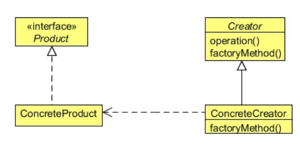

## Factory Method Design Pattern

## Project Requirements
- A product company has shifted the way they used to take orders from their clients.
- The company is now looking to use an application to take orders from them.
- They receive orders, errors in orders, feedback for the previous order, and response to the order in an XML format.
- The company has asked you to develop an application to parse the XML and display the result to them.

## Development challenges
- The main challenge for you is to parse an XML and display it's content to the user. 
- There are different XML formats depending on the different types of messages the company receives from its clients.
- **For example:**
  - **An order type XML has different sets of xml tags as compared to the response or error XML.**
- **But the core job is the same. That is, to display to the user the message being carried in these XMLs.**

## How Factory method resolves the challenges
- The factory method pattern, suited for this situation, defines an interface for creating an object, but let subclasses decide which class to instantiate.
- Factory method lets a class defer instantiation to subclasses.

## What is Factory method pattern?
- It encapsulates the functionality required to select and instantiate an appropriate class, inside a designated method referred to as a factory method.
- Factory method selects an appropriate class hierarchy based on the application context and other influencing factors.
- It then instantiates the selected class and returns it as an instance of the parent class type.
- The advantage of this approach is that the application objects can make use of the factory method to get access to the appropriate class instance.
- This eliminates the need for an application object to deal with the varying class selection criteria.

## Elements of Factory method pattern

- **Product:** Defines the interface of objects the factory method creates.
- **ConcreteProduct:** Implements the product interface.
- **Creator:** Declares the factory method, which returns an object of type Product. Creator may also define a default implementation fo the factory method that returns a default **ConcreteProduct** object.
- **ConcreteCreator:** Overrides the factory method to return an instance of a **ConcreteProduct.**

## How it helps?
Factory methods eliminate the need to bind application-specific classes into your code. The code only deals with the Product interface; therefore it can work with any user-defined **ConcreteProduct** class.

